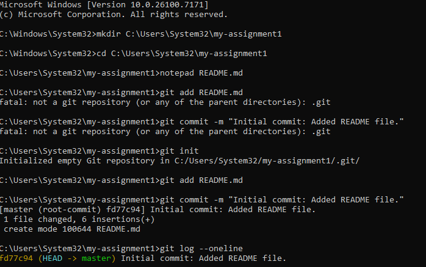
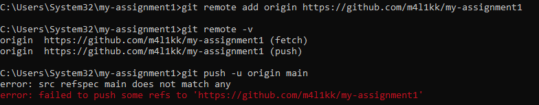
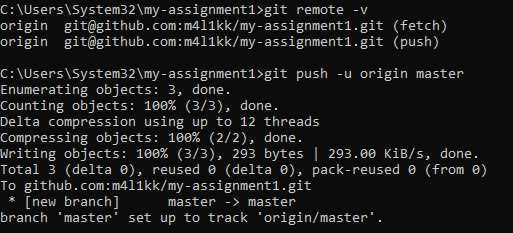
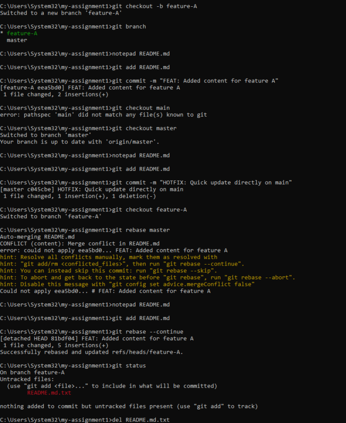
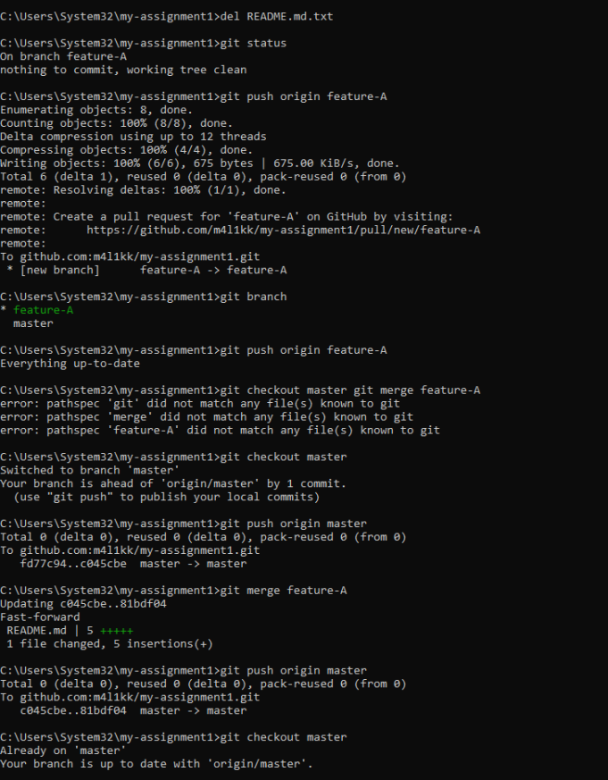
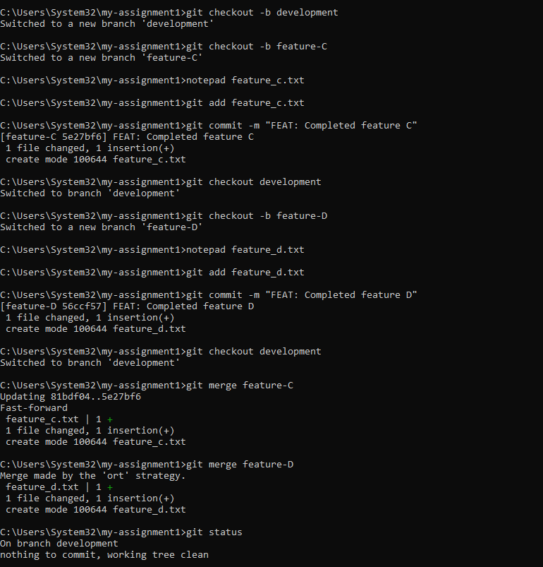
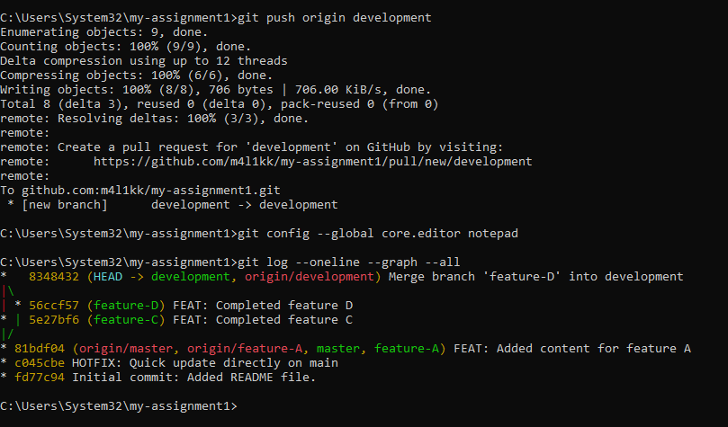

# Git Version Control Assignment

## Phase 1: Local Repository Initialization

## Phase 2: Remote Setup and Synchronization

## Phase 3: Branching, Changes, and Rebase

## Phase 5: Branch Integration

